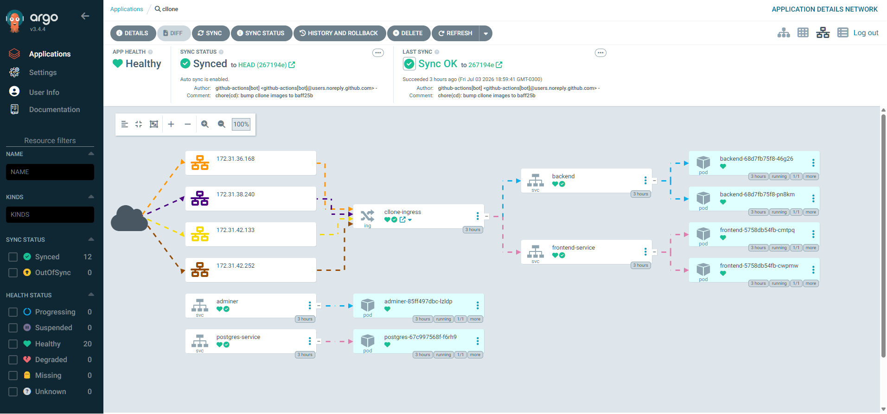
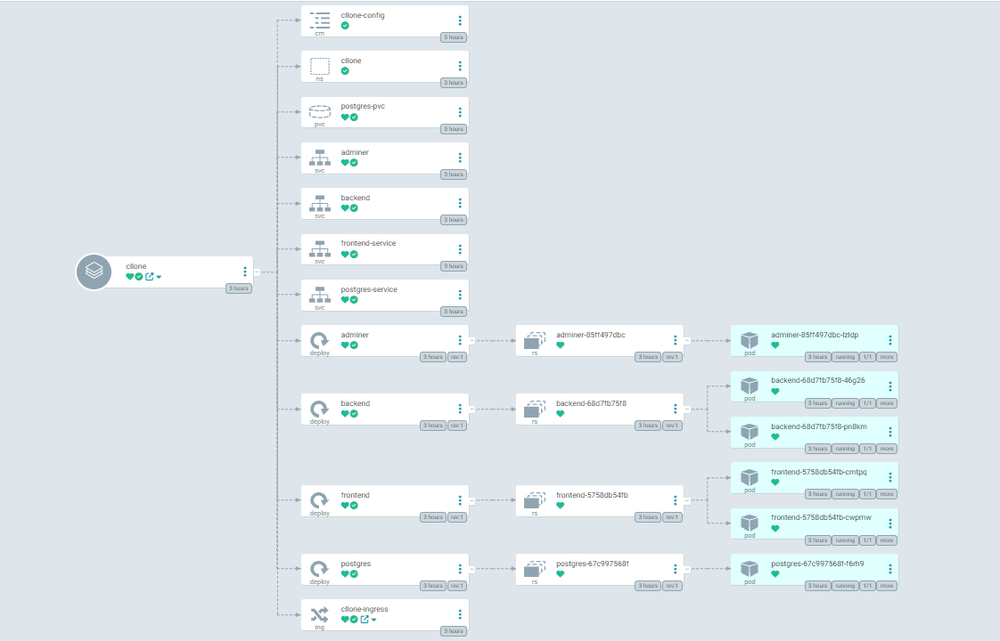

# Trabalho Final – Fundamentos de DevOps

**Aluno:** Henrique Furtado
**Projeto:** cllone — Kanban full-stack com deploy contínuo via GitOps
**Repositórios:**
- Aplicação + Infraestrutura: <https://github.com/henrique-furtado47/cllone>
- GitOps (manifests): <https://github.com/henrique-furtado47/cllone-gitops>

---

## 1. Introdução

O **cllone** é uma aplicação de gerenciamento de tarefas no estilo *Kanban*
(quadros, equipes, membros e tarefas). O objetivo do trabalho é levar essa
aplicação **full-stack** da fase de desenvolvimento até um ambiente de produção
em nuvem, aplicando as práticas de DevOps vistas na disciplina: *Infraestrutura
como Código*, *contêineres*, *orquestração com Kubernetes*, *Integração
Contínua (CI)* e *Entrega Contínua (CD) via GitOps*.

**Tecnologias utilizadas:**

| Camada            | Tecnologia                                        |
|-------------------|---------------------------------------------------|
| Frontend          | Vue 3 + Vite (servido por Nginx)                  |
| Backend           | Django + Django REST Framework (Gunicorn)         |
| Banco de dados    | PostgreSQL 16                                      |
| Contêineres       | Docker (imagens no Docker Hub)                     |
| Provisionamento   | Terraform (AWS EC2)                                |
| Configuração      | Ansible (k3s + ArgoCD)                             |
| Orquestração      | Kubernetes (k3s)                                   |
| Ingress           | Traefik (embutido no k3s)                          |
| CI/CD             | GitHub Actions                                     |
| GitOps            | ArgoCD + Kustomize                                 |
| Visualização BD   | Adminer                                            |

**Arquitetura geral:**

```
Desenvolvedor
   │ git push (repo cllone)
   ▼
GitHub Actions ── testa ── builda imagens ── push Docker Hub
   │ commit bump de tag
   ▼
Repo GitOps (cllone-gitops) ──▶ ArgoCD ──▶ Cluster k3s (AWS EC2)
                                                │
                     Traefik :80 ──┬── /      ─▶ frontend (Vue/Nginx)
                                   ├── /api   ─▶ backend (Django)
                                   └── /admin ─▶ backend
                                   PostgreSQL ◀─ backend
                                   Adminer :30800 ─▶ PostgreSQL
```

---

## 2. Escolha do Ambiente

- **Tipo de ambiente:** Cloud (AWS EC2, via **AWS Learner Lab**).
- **Justificativa:** o Learner Lab é o ambiente disponibilizado na disciplina e
  reproduz um cenário real de nuvem. As instâncias EC2 permitem montar um
  cluster Kubernetes de verdade (múltiplos nós), diferentemente de um cluster
  local de nó único. Optou-se por **k3s** por ser leve, oficialmente sugerido
  em sala e por já trazer o **Traefik** como Ingress Controller.
- **Instâncias criadas:**

| Papel          | Qtd | Tipo       | SO             | Função                                |
|----------------|-----|------------|----------------|---------------------------------------|
| control-plane  | 1   | t3.medium  | Ubuntu 22.04   | k3s server + ArgoCD + Traefik         |
| worker         | 3   | t3.medium  | Ubuntu 22.04   | k3s agents (executam os pods)         |

  Total: **4 instâncias** (1 control plane + 3 workers), atendendo ao requisito
  de "1 control plane + 3 ou mais nós de trabalho". Cada instância tem disco
  `gp3` de 20 GB. Um único **Security Group** libera SSH (22), HTTP/HTTPS
  (80/443 para o Traefik), a API do k3s (6443), a faixa de NodePorts
  (30000–32767) e todo o tráfego interno entre os nós.

  Um **Elastic IP** foi associado ao control plane para manter o IP público
  **fixo** entre os desligamentos automáticos do Learner Lab (o cluster
  reinicia sozinho via systemd e volta no mesmo endereço). IP fixo utilizado:
  **54.152.108.122**.

---

## 3. Provisionamento

- **Ferramentas:** **Terraform** (provisiona a infra) + **Ansible** (configura o
  cluster). O código fica em [`infra/`](../infra) no repositório da aplicação.

- **Terraform** (`infra/terraform/`):
  - `main.tf` — provider AWS, data source da AMI Ubuntu 22.04 (Canonical),
    `aws_key_pair`, `aws_security_group`, a instância `control_plane` e as
    `worker` (via `count = var.worker_count`, default 3).
  - `variables.tf` / `outputs.tf` / `terraform.tfvars.example`.
  - Ao final, um recurso `local_file` usa `templatefile()` para **gerar
    automaticamente o inventory do Ansible** (`infra/ansible/inventory.ini`)
    com os IPs das instâncias — integrando Terraform → Ansible.

  Execução:
  ```bash
  # credenciais temporárias do Learner Lab exportadas como env vars
  cd infra/terraform
  cp terraform.tfvars.example terraform.tfvars
  terraform init && terraform apply -auto-approve
  ```

- **Ansible** (`infra/ansible/playbook.yml`), três *plays*:
  1. **control plane** — instala o k3s server
     (`curl -sfL https://get.k3s.io | sh -s - server --write-kubeconfig-mode 644
     --tls-san <ip_publico>`), aguarda e lê o `node-token`.
  2. **workers** — instalam o k3s agent e fazem *join* usando o **IP privado**
     do master e o token
     (`K3S_URL=https://<ip_privado>:6443 K3S_TOKEN=<token>`).
  3. **control plane** — instala o **ArgoCD**, expõe via NodePort, cria o
     namespace `cllone` + o `Secret` da aplicação e registra a *Application* do
     ArgoCD.

  Execução:
  ```bash
  cd infra/ansible
  ansible-playbook playbook.yml
  ```

- **Desafios e soluções (encontrados na prática):**
  - *Credenciais temporárias do Learner Lab* → exportadas via `~/.aws/credentials`;
    erro de auth = token expirado, basta recopiar do "AWS Details".
  - *Instalação do ArgoCD falhava* com `CustomResourceDefinition ... annotations:
    Too long: may not be more than 262144 bytes` — os CRDs do ArgoCD são grandes
    demais para o `kubectl apply` padrão (guarda o `last-applied` em annotation).
    **Solução:** aplicar com `--server-side=true --force-conflicts`.
  - *IP público mudava a cada desligamento do lab* → resolvido com **Elastic IP**
    fixo no control plane.
  - *`ansible.cfg` ignorado* por estar em diretório "world writable" (disco do
    Windows montado no WSL) → contornado passando `-i inventory.ini`
    explicitamente (as opções de SSH já ficam no próprio inventory).
  - *Idempotência* → uso de `creates:` nos comandos de instalação do k3s e de
    `--dry-run=client -o yaml | kubectl apply -f -` para o Secret.
  - *Comunicação entre nós* → o join dos workers usa o **IP privado** do master
    (dentro da VPC) e o Security Group libera o tráfego interno (self).

---

## 4. Cluster Kubernetes

- **Ferramenta:** **k3s** v1.36.2+k3s1 (distribuição Kubernetes leve da Rancher),
  instalado via Ansible.
- **Configuração dos nós:** 1 server (control plane) + 3 agents (workers). O
  server roda com `--tls-san <ip_publico>` para permitir `kubectl` remoto e
  `--write-kubeconfig-mode 644` para leitura do kubeconfig. Os agents ingressam
  no cluster com a URL/token do server.
- **Testes de funcionamento:** o playbook executa `kubectl get nodes` ao final e
  o resultado confirma os 4 nós `Ready`:

  ```text
  NAME               STATUS   ROLES           AGE     VERSION
  ip-172-31-42-133   Ready    control-plane   4m58s   v1.36.2+k3s1
  ip-172-31-36-168   Ready    <none>          4m11s   v1.36.2+k3s1
  ip-172-31-38-240   Ready    <none>          4m12s   v1.36.2+k3s1
  ip-172-31-42-252   Ready    <none>          4m11s   v1.36.2+k3s1
  ```

  Outras verificações:
  ```bash
  kubectl get pods -A            # pods de sistema + traefik + argocd + cllone
  kubectl get pods -n cllone     # postgres, backend, frontend, adminer
  ```
  O acesso remoto é feito copiando `/etc/rancher/k3s/k3s.yaml` e trocando
  `127.0.0.1` pelo IP público do control plane.

---

## 5. GitOps com ArgoCD

- **Instalação do ArgoCD:** automatizada no `playbook.yml`
  (`kubectl apply -n argocd --server-side=true --force-conflicts -f .../install.yaml`),
  com espera pelo rollout e *patch* do service `argocd-server` para NodePort. A
  senha inicial de admin é lida do secret `argocd-initial-admin-secret`. O
  `--server-side` é necessário porque os CRDs do ArgoCD excedem o limite de
  tamanho de annotation do `apply` client-side.

- **Configuração do repositório Git:** os manifests ficam no repositório
  separado **cllone-gitops**, organizados com **Kustomize** em `k8s/`:
  namespace, configmap, secret (modelo), PVC/Deployment/Service do PostgreSQL,
  Deployments/Services de backend e frontend, **Adminer** e o **Ingress do
  Traefik**. O `argocd/application.yaml` define a *Application*:

  ```yaml
  source:
    repoURL: https://github.com/henrique-furtado47/cllone-gitops.git
    path: k8s
    targetRevision: HEAD
  destination:
    namespace: cllone
  syncPolicy:
    automated: { prune: true, selfHeal: true }
    syncOptions: [ CreateNamespace=true ]
  ```

- **Deploy da aplicação (fluxo CD ponta a ponta):**
  1. `git push` na `main` do repo **cllone** dispara o **GitHub Actions**;
  2. rodam os testes (Django + build do frontend);
  3. as imagens `cllone-backend:<sha>` e `cllone-frontend:<sha>` são publicadas
     no Docker Hub;
  4. o workflow faz `kustomize edit set image` e commita a nova tag no repo
     **cllone-gitops**;
  5. o **ArgoCD** detecta o commit e **sincroniza** o cluster automaticamente
     (auto-sync + self-heal + prune).

- 
- 
  - Tela da *Application* `cllone` com status **Synced/Healthy**;
  - Árvore de recursos (deployments, services, ingress, pods) em verde.

---

## 6. Aplicação

- **Descrição:** *cllone* é um Kanban. O **backend** (Django REST Framework)
  expõe a API em `/api/` (autenticação por token, tarefas, equipes, membros) e
  documentação Swagger em `/api/docs/`. O **frontend** (Vue 3) consome essa API.
  O **PostgreSQL** persiste os dados (via PVC). O **Adminer** permite visualizar
  o banco pela web.

- **Comunicação entre os serviços:**
  - frontend → backend: chamadas para `/api/` são roteadas pelo **Traefik** ao
    service `backend:8000` (mesma origem, sem CORS);
  - backend → banco: variáveis `POSTGRES_HOST=postgres-service`, credenciais do
    `Secret cllone-secrets`;
  - configuração não-sensível no `ConfigMap cllone-config`, sensível no `Secret`.

- **Como acessar** (IP público fixo do control plane = **54.152.108.122**):

  | Recurso           | URL                                          |
  |-------------------|----------------------------------------------|
  | Frontend          | `http://54.152.108.122/`                     |
  | API / Swagger     | `http://54.152.108.122/api/` • `/api/docs/`  |
  | Django admin      | `http://54.152.108.122/admin/`               |
  | Adminer (banco)   | `http://54.152.108.122:30800/`               |
  | ArgoCD            | `https://54.152.108.122:31051` (admin)       |

---

## 7. Conclusão

- **Lições aprendidas:** integração ponta a ponta das práticas de DevOps —
  IaC (Terraform), *config management* (Ansible), contêineres (Docker),
  orquestração (k3s), CI (GitHub Actions) e CD declarativo (ArgoCD/GitOps). Ficou
  clara a diferença entre CD *push* (pipeline aplica no cluster) e **GitOps**
  *pull* (o cluster converge para o estado do Git).
- **Dificuldades encontradas:** credenciais temporárias do Learner Lab, join dos
  workers pelo IP privado correto, regras de Security Group para o tráfego
  interno e roteamento por caminho no Traefik (`/api` vs `/`).
- **O que faria diferente:** usar `terraform apply` chamando o Ansible via
  `local-exec` para um provisionamento em um único comando, gerenciar segredos
  com **ansible-vault**/*sealed-secrets* e adicionar HTTPS (cert-manager) e
  observabilidade (Prometheus/Grafana).

---

## 8. Link para Repositório

- **Aplicação + Infraestrutura:** <https://github.com/henrique-furtado47/cllone>
- **GitOps (manifests + ArgoCD):** <https://github.com/henrique-furtado47/cllone-gitops>
